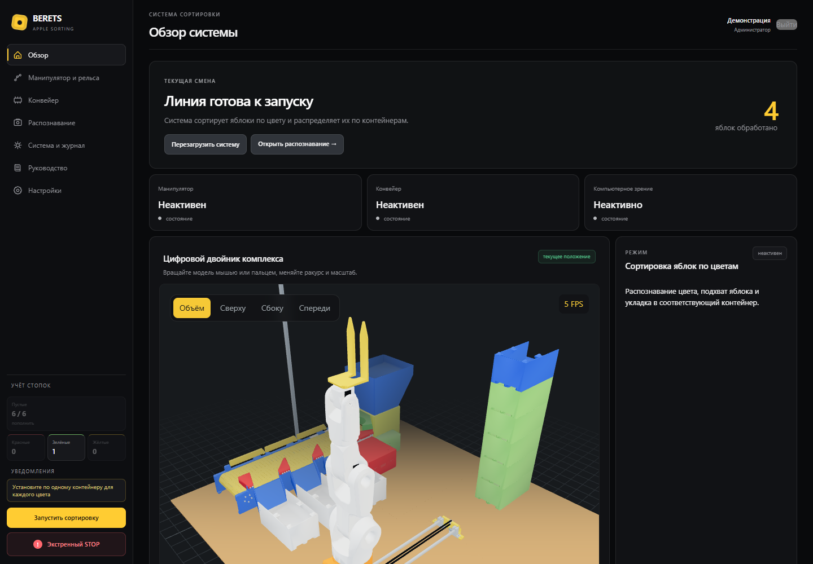
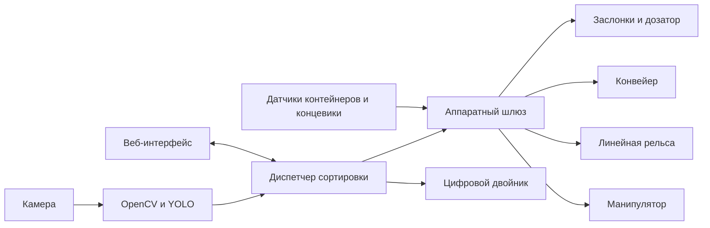

# BERETS

**BERETS** — учебно-демонстрационная робототехническая платформа для автоматической сортировки яблок по цветовым категориям. Комплекс объединяет компьютерное зрение, конвейер, сервоприводные заслонки, манипулятор на линейной оси и защищённый операторский веб-интерфейс.

> Репозиторий содержит очищенную публичную редакцию программного обеспечения. Учётные записи, секреты, сетевые параметры, обучающие данные и веса модели в него не включены. Маршрутные точки приведены только как отключённый пример и требуют повторной калибровки на каждом механизме.



## Возможности

- распознавание красных, зелёных и жёлтых яблок моделью YOLO;
- сопровождение объектов и защита от повторного подсчёта;
- управление тремя сортировочными заслонками и дозатором;
- контроль наличия приёмных контейнеров;
- автоматическая замена заполненного контейнера пустым;
- четырёхосевой манипулятор на линейной рельсе;
- редактируемые маршрутные точки и высотные профили стопок;
- интерактивный трёхмерный цифровой двойник;
- роли администратора, оператора и наблюдателя;
- журнал событий, диагностика, уведомления и голосовое сопровождение;
- безопасный демонстрационный режим без подключения GPIO и UART;
- 146 автоматических программных проверок в исходной редакции проекта.

Численные показатели повторяемости и производительности будут опубликованы после отдельной серии воспроизводимых испытаний.

## Архитектура



Единственным программным владельцем UART и GPIO является аппаратный шлюз. HTTP-обработчики передают ему задания через внутренние контроллеры и не формируют импульсы STEP или пакеты сервоприводов напрямую.

Подробности: [архитектура](docs/ARCHITECTURE.md), [аппаратная часть](docs/HARDWARE.md), [безопасный запуск](docs/SAFE_START.md).

## Состав репозитория

```text
software/flask_app/      основной веб-интерфейс и управление комплексом
software/apple_sorting/  отдельные утилиты проверки камеры и модели
docs/                    архитектура, безопасность и план развития
media/                   изображения для документации
```

Обученные веса YOLO и исходный набор изображений не публикуются. Путь к собственным весам задаётся переменной `BERETS_YOLO_MODEL`.

## Безопасный локальный запуск

По умолчанию все реальные исполнительные механизмы отключены.

```bash
cd software/flask_app
python3 -m venv .venv
source .venv/bin/activate
python3 -m pip install -r requirements.txt
cp berets.env.example berets.env
```

Создайте уникальные секреты:

```bash
python3 -c "import secrets; print(secrets.token_urlsafe(48))"
python3 -c "import secrets; print(secrets.token_urlsafe(18))"
```

Первую строку сохраните как `BERETS_SECRET_KEY`, вторую — как `BERETS_SYSTEM_PASSWORD` в локальном `berets.env`. Этот файл исключён из Git.

```bash
set -a
source berets.env
set +a
python3 pr3.py
```

Откройте `http://127.0.0.1:5000`. При первом входе создайте личную учётную запись администратора.

Файлы `manipulator_routes.example.json` и `vision_zones.example.json` предназначены для изучения структуры. Для собственного стенда создайте рабочие копии без суффикса `.example` и обязательно откалибруйте их заново.

## Проверка

```bash
cd software/flask_app
python3 -m pytest -q
python3 -m compileall -q .
```

Автоматические проверки не подтверждают безопасность физического движения. Испытания с реальным оборудованием выполняются поузлово, на малой скорости, без груза и с возможностью немедленного отключения силового питания.

## Реальное оборудование

Публичная конфигурация содержит только отключённые флаги `BERETS_REAL_*`. Не включайте их все одновременно. Сначала проверьте напряжения, полярность, UART, каждый датчик, каждый привод, концевики и направление рельсы.

Критические ограничения:

- GPIO Raspberry Pi работает только с логическими уровнями 3,3 В;
- силовое питание приводов не проходит через Raspberry Pi;
- TMC2209 и шаговый двигатель нельзя соединять или разъединять под напряжением;
- программная кнопка не заменяет аппаратную аварийную остановку;
- перед первым абсолютным перемещением рельса должна найти исходное положение;
- подключение к интерфейсу из интернета без отдельного защищённого шлюза не поддерживается.

## План развития

Текущая редакция фиксируется как **BERETS Classic**. Следующее поколение планируется как отдельная система на Ubuntu 24.04 ARM64, ROS 2 Jazzy и Gazebo Harmonic с URDF-моделью, RViz, записью событий и переключением между симуляцией и физическим оборудованием.

Подробнее: [ROADMAP.md](docs/ROADMAP.md).

## Безопасность

Не публикуйте журналы, `.env`, `users.json`, маршрутные точки конкретного стенда, сетевые адреса и ключи. Инструкция по ответственному сообщению об уязвимостях находится в [SECURITY.md](SECURITY.md).

## Использование материалов

Права на оригинальный код, документацию и модели сохраняются за авторами проекта. Открытая или коммерческая лицензия для BERETS пока не предоставлена. Для распространения, коммерческого использования или создания производного продукта требуется отдельное письменное разрешение.

В составе трёхмерного просмотрщика используется Three.js по лицензии MIT. Уведомление приведено в [THIRD_PARTY_NOTICES.md](THIRD_PARTY_NOTICES.md).

## Автор

Проект BERETS — разработка [ebergovin-ui](https://github.com/ebergovin-ui).
